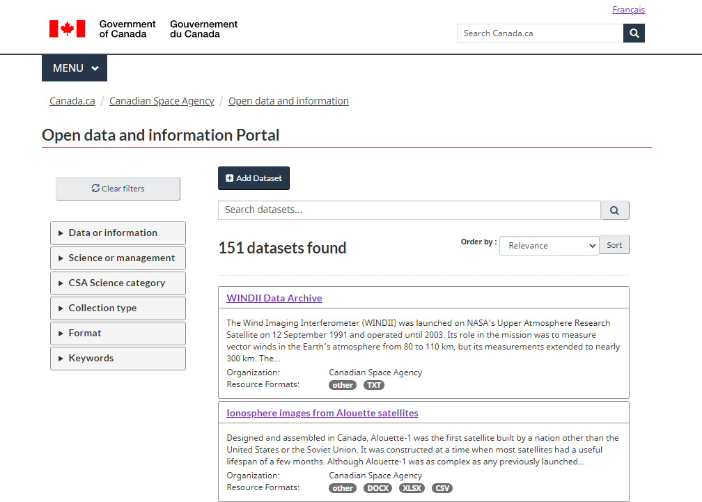
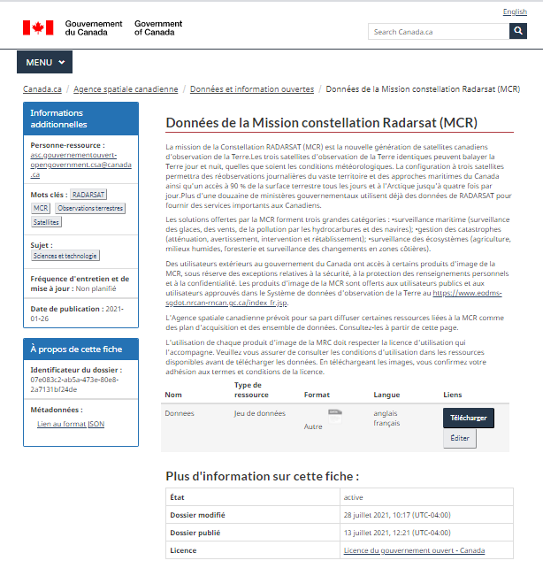

-----------------
ckanext-asc-csa (English follows)
-----------------
Cette extension CKAN permet l'implémentation du thème du gouvernement du Canada. Le site qui en résulte est entièrement
bilingue, accessible, et permet la visualisation des données dans le navigateur.

------------
Prérequis
------------

Cette version de l'extension est compatible avec CKAN 2.9. Les versions précédentes (0.1-0.4) étaient compatibles avec CKAN 2.8.

Cette extension requiert l'extension `ckanext-asc-csa-scheming <https://github.com/asc-csa/ckanext-asc-csa-scheming/>`_
ainsi que `ckanext-fluent <https://github.com/ckan/ckanext-fluent>`_.

------------
Installation
------------

Pour des instructions d'installation, veuillez vous référer au `document instructions d'installation </installation%20guide/installation%20guide_fr.md>`_.

=============
ckanext-asc-csa (le français précède)
=============

This CKAN extension allows for the implementation of the Government of Canada theme. The resulting site is
bilingual, accessible, and allows for in-browser data visualization.

------------
Requirements
------------

This version of the extension is intended for CKAN 2.9. Earlier releases (0.1-0.4) were intended for CKAN 2.8.

This extension is intended to be used alongside `ckanext-asc-csa-scheming <https://github.com/asc-csa/ckanext-asc-csa-scheming/>`_
as well as `ckanext-fluent <https://github.com/ckan/ckanext-fluent>`_.

------------
Installation
------------

For full installation instructions, please refer to the `installation instructions document </installation%20guide/installation%20guide_en.md>`_.
