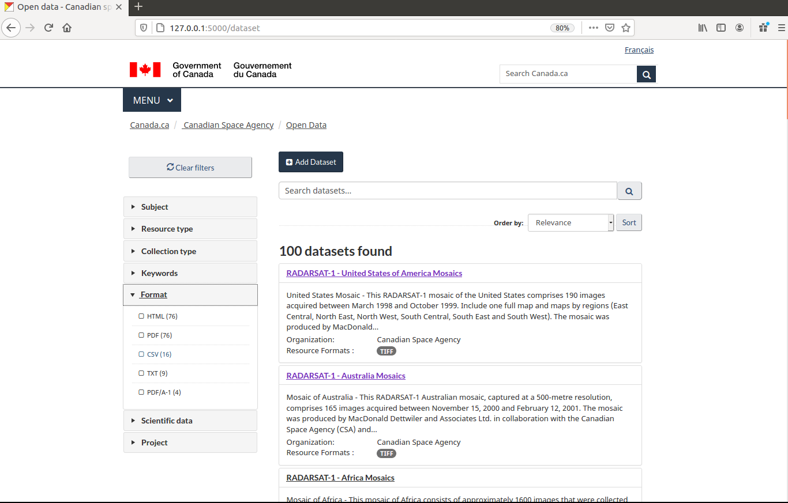
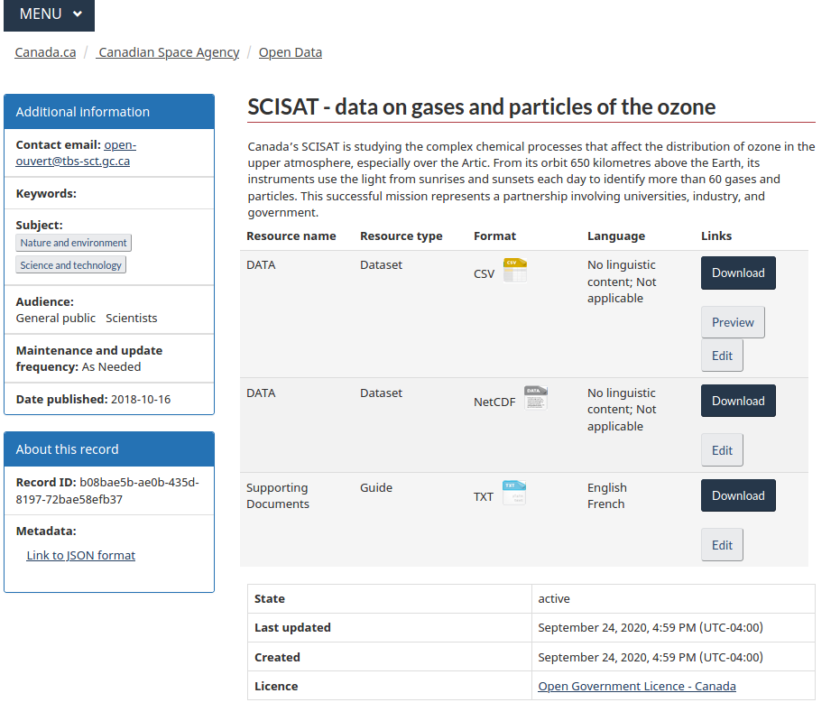

    

-----------------
ckanext-csa (English follows)
-----------------

Cette extension de ckan permet d'implémenter les standards du gouvernement du Canada à CKAN tout en permettant la
prévisualisation des données.

------------
Pré-requis
------------

Cette extension est compatible avec ckan 2.8 . Le support pour ckan 2.9 n'est pas encore prévu.

Cette extension requiert l'extension ckanext-fluent et une branche spécifique de ckanext-scheming. L'extension scheming nécessaire est d'ailleurs fournis dans ce répertoire

------------
Installation
------------

Pour installer ckanext-csa:

1. Activer votre environnement virtuel, par exemple::

     . /usr/lib/ckan/default/bin/activate

2. Installer l'extension dans votre environnement virtuel::

     pip install ckanext-csa

3. Ajouter ``csa`` à la liste dans le paramètre ``ckan.plugins`` situé dans le fiichier de
configuration de ckan (par défaut :
   ``/etc/ckan/default/production.ini``).

4. Redémarrez CKAN. Par eemple, si vous avez déployer CKAN avec apache sur Ubuntu::

     sudo service apache2 reload

------------------------
 Installation à fin de développement
------------------------

Pour installer ckanext à des fins de développement::

    git clone https://github.com/pratickbaral/ckanext-csa.git
    cd ckanext-csa
    python setup.py develop
    pip install -r dev-requirements.txt

-----------------
Tester l'extension
-----------------

Pour lancer les tests::

    nosetests --nologcapture --with-pylons=test.ini

Pour exécuter les tests et produire un rapport de 'coverage', assurez-vous d'abord
 que 'coverage' est installé dans votre environnement virtuel (`` pip install coverage '') puis exécutez::

    nosetests --nologcapture --with-pylons=test.ini --with-coverage --cover-package=ckanext.csa --cover-inclusive --cover-erase --cover-tests
    
    
    
  
=============
ckanext-csa ( Le francais précède)
=============

This ckan extension allows for the implementation of the government of canada theme. It also allows
bilingual visualisation of ckan in both english and french while allowing for the previsualisation of data. This
extension has been designed to bring the CSA standard to ckan.

------------
Requirements
------------

This extension is intended for ckan 2.8. Support for CKAN 2.9 has yet to be implemented as it would required
major changes at a point where we are still in the development for the support of the 2.8 version.

This package require ckanext-fluent and a special fork of ckanext-scheming to work

------------
Installation
------------

.. Add any additional install steps to the list below.
 For example installing any non-Python dependencies or adding any required
 config settings.

To install ckanext-csa:

1. Activate your CKAN virtual environment, for example::

   . /usr/lib/ckan/default/bin/activate

2. Install the ckanext-csa Python package into your virtual environment::

   pip install ckanext-csa

3. Add ``csa`` to the ``ckan.plugins`` setting in your CKAN
 config file (by default the config file is located at
 ``/etc/ckan/default/production.ini``).

4. Restart CKAN. For example if you've deployed CKAN with Apache on Ubuntu::

   sudo service apache2 reload

---------------
Config Settings
---------------

Document any optional config settings here. For example::

  # The minimum number of hours to wait before re-checking a resource
  # (optional, default: 24).
  ckanext.csa.some_setting = some_default_value

------------------------
Development Installation
------------------------

To install ckanext-csa for development, activate your CKAN virtualenv and
do::

  git clone https://github.com/pratickbaral/ckanext-csa.git
  cd ckanext-csa
  python setup.py develop
  pip install -r dev-requirements.txt

-----------------
Running the Tests
-----------------

To run the tests, do::

  nosetests --nologcapture --with-pylons=test.ini

To run the tests and produce a coverage report, first make sure you have
coverage installed in your virtualenv (``pip install coverage``) then run::

  nosetests --nologcapture --with-pylons=test.ini --with-coverage --cover-package=ckanext.csa --cover-inclusive --cover-erase --cover-tests

